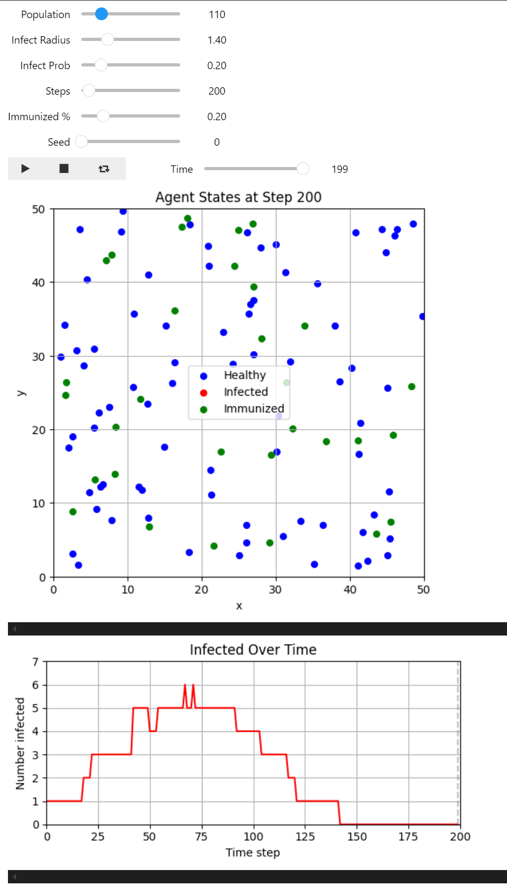

# Contagion
An interactive, agent-based simulation of contagion dynamics in a confined 2D space. It models how infectious diseases can spread in a population with varying degrees of vaccination (immunization) and explores how these parameters influence epidemic outcomes over time.

## Overview

Agents (representing individuals) move in a 50×50 nm² box and can be in one of three states:

* **Healthy**
* **Infected**
* **Immunized** (vaccinated)

## Model

The model incorporates realistic dynamics:

* Infections occur through proximity-based contact.
* Immunized individuals have a reduced probability of getting infected (simulating breakthrough cases).
* Infected agents eventually recover and become immunized again, allowing for reinfection dynamics (endemic behavior).

## Features

* **Interactive simulation** using Jupyter widgets
* **Parameter controls** for population size, infection radius, probability, vaccination rate, and simulation length
* **Live visualizations**:

  * Agent positions and infection status
  * Infection trend over time
* **Modular code** structure for easy extension or integration into dashboards



## Packages Used

* Python (NumPy, Matplotlib)
* Jupyter Notebook
* `ipywidgets` for interactivity
* Custom module (`sim_code.py`) for agent logic

# How to Run

1. Clone this repo and ensure the following files are present:

   * `dynamic_plotting.ipynb` (main notebook)
   * `sim_code.py` (simulation functions)

2. Install the required packages:

   ```bash
   pip install numpy matplotlib ipywidgets
   ```

3. Open the notebook in Jupyter:

   ```bash
   jupyter notebook dynamic_plotting.ipynb
   ```

4. Adjust parameters using sliders and run the simulation.

5. Observe the live updates of agent states and infection trends.


## Ideas for Extension

* Add real-world data integration via APIs
* Build a web app using Streamlit or Dash
* Compare policy scenarios across regions
